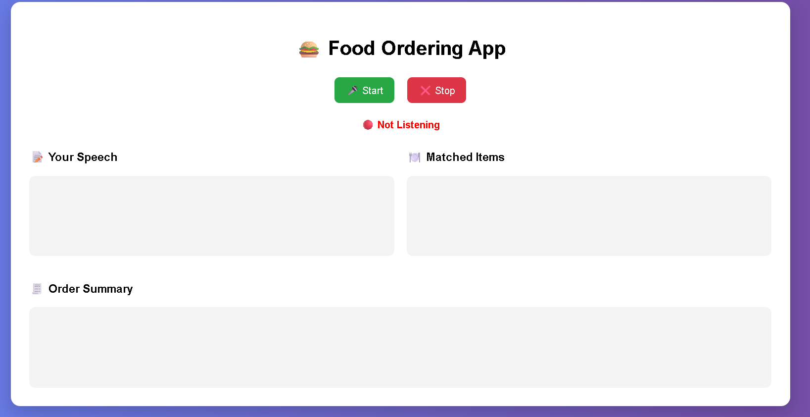
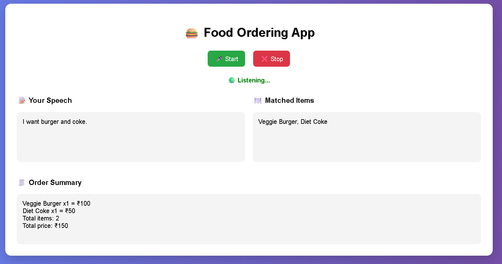

# 🍔 AI Food Ordering App (Voice-Based)

An intelligent and interactive **voice-powered food ordering system** that allows users to place orders using natural speech. The system converts speech to text in real-time, matches it with menu items, and generates an order summary with pricing.

---

## 🚀 Features

- 🎤 Real-time Voice Input (Speech-to-Text)
- 🧠 Smart Item Matching (NLP-based logic)
- 🔢 Quantity Detection (e.g., "two burgers")
- 🧾 Order Summary Generation
- 💰 Automatic Price Calculation
- 🎨 Professional UI (Centered + Colorful + Animated)
- 🔄 Loading Spinner for better UX
- 🟢 Live Listening Indicator
- ❌ Stop Button (Control voice input)
- ⚡ Fast & Lightweight System

---

## 🛠️ Tech Stack

- **Frontend:** HTML, CSS, JavaScript (Web Speech API)
- **Backend:** FastAPI (Python)
- **Logic:** Regex + Rule-Based NLP
- **Database:** JSON (Menu Data)
- **Server:** Uvicorn

---

## 📁 Project Structure


voice-ordering-app/
│
├── app/
│ ├── api/
│ │ └── routes.py
│ ├── services/
│ │ ├── matching_service.py
│ │ ├── order_service.py
│ └── main.py
│
├── data/
│ └── menu.json
│
├── frontend/
│ └── index.html
│
├── images/
│ ├── ui.png
│ └── output.png
│
├── requirements.txt
└── README.md


---

## ⚙️ Installation & Setup

### 1️⃣ Clone Repository

```bash
git clone https://github.com/Ruchi-novadule/voice-ordering-ai-app.git
cd voice-ordering-ai-app
2️⃣ Install Dependencies
pip install -r requirements.txt
3️⃣ Run Backend Server
uvicorn app.main:app --reload
4️⃣ Run Frontend
Open frontend/index.html in browser
OR use Live Server in VS Code
🎯 Usage
Click 🎤 Start
Speak your order:

Example:

I want one burger and two coke
Click ❌ Stop (optional)
📊 Output Example
Matched Items:
Veggie Burger, Diet Coke

Order Summary:
Veggie Burger x1 = ₹100
Diet Coke x2 = ₹100

Total items: 3
Total price: ₹200
🧠 How It Works
🎤 Voice input captured via Web Speech API
📝 Converted to text in real-time
🔍 Matching logic identifies menu items
🔢 Quantity extracted using regex
🧾 Summary generated
💰 Total price calculated
🎨 UI Highlights
Modern card-based design
Gradient background
Animated buttons
Loading spinner
Live listening status indicator

📸 Screenshots
### 🖥️ UI


### 📊 Output



🔥 Future Enhancements
🔊 Voice Output (AI speaks response)
📱 Mobile Responsive Design
🧠 AI Recommendation System
💳 Payment Integration
🌍 Multi-language Support
💼 Use Case

This project demonstrates:

Voice-based user interfaces
NLP-based order processing
Real-world restaurant automation system
Full-stack development (Frontend + Backend)
👩‍💻 Author

Ruchi Tiwari

⭐ Support

If you like this project, give it a ⭐ on GitHub!
